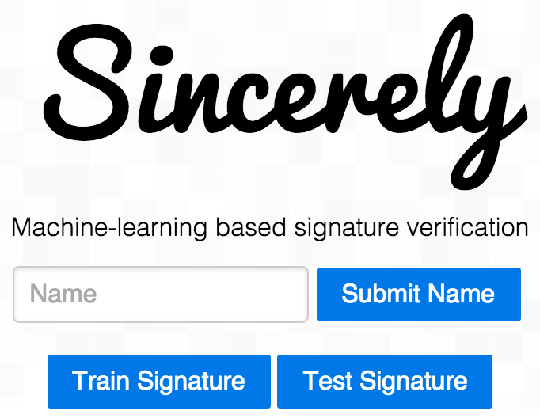

# sincerely

If you'd like to run our application, clone this repo.  Follow these steps to run the server:

```
cd sincerely
python -m SimpleHTTPServer
```

Open up localhost and check it out! Add your name (or whoever's name) to the box and click "Submit Name". When you do this, that creates a concept of your name. Then, draw your signature in the canvas below, and click "Train Signature". You can right click to clear the canvas, and continue doing this to your heart's content.

Now, if you want to test your signature, have a friend (or use your other hand) to try writing your signature again, and hit "Test Signature". The system will then tell you if your signature is verified by our machine learning system, powered by Clarifai and WILL. Enjoy!
